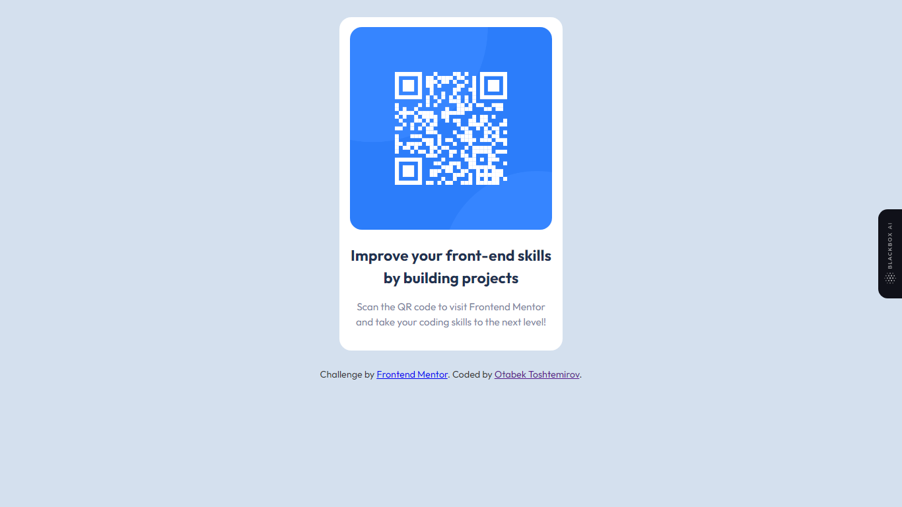

# Frontend Mentor - QR code component solution

This is a solution to the [QR code component challenge on Frontend Mentor](https://www.frontendmentor.io/challenges/qr-code-component-iux_sIO_H). Frontend Mentor challenges help you improve your coding skills by building realistic projects. 


## Overview

### Screenshot



### Links

- Solution URL: [https://github.com/OtabekToshtemirov/QR-code]
- Live Site URL: [https://64a9136e4dd25f56f6c76fcd--cerulean-liger-e67e70.netlify.app/]

## My process

### Built with

- Semantic HTML5 markup
- CSS custom properties


### What I learned
 I just trained my skills in HTML and CSS for don't forget them. I didn't use any frameworks or libraries. I just used HTML and CSS.
```html
<h1>Some HTML code I'm proud of</h1>
```


### Continued development

I'm focusing on learning JavaScript and React. I'm going to learn them and I'm going to be a Frontend Developer. I'm going to learn JavaScript and React in 2 months. 


   

## Author

- Website - [Otabek Toshtemirov](https://www.Otabek98.netlify.com)
- Frontend Mentor - [@yourusername](https://www.frontendmentor.io/profile/OtabekToshtemirov)
- Twitter - [@yourusername](https://www.twitter.com/toshtemirovOta)


  
